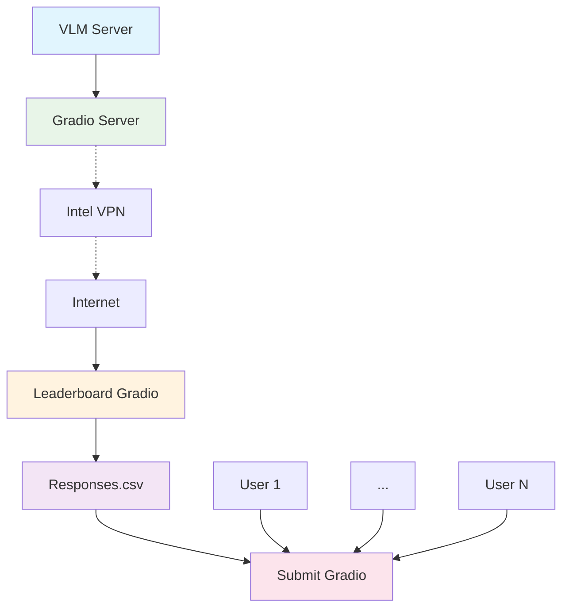

# Demo Architecture



# Inference Setup with vLLM

On a GPU node, install the dependencies:

```shell
uv venv --python 3.12
source .venv/bin/activate
uv pip install vllm
```
To serve the model:

```shell
vllm serve Qwen/Qwen2.5-1.5B-Instruct \
  --task generate \
  --model-impl transformers \
  --host 0.0.0.0
```
